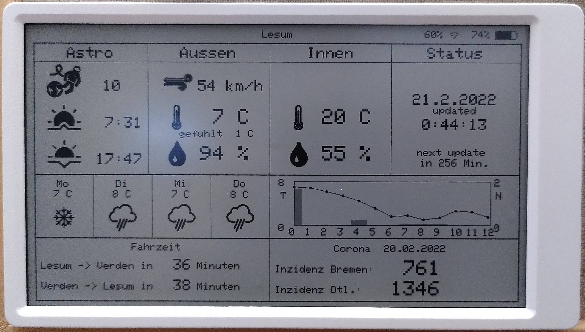

# M5PaperWeather

Modified version of M5PaperWeather: https://github.com/Bastelschlumpf/M5PaperWeather

Features:

* Local weather forecast
* Astronauts currently in space 
* Coraona virus incidence

## Getting Started
> You need to rename `ConfigTemplate.h` to `Config.h` and put your own infos in there.

## Screen Shot

